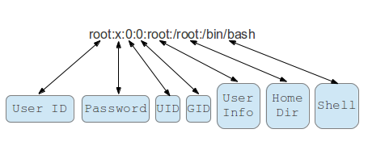

#### Users in linux
##### Types of users
- System
- Interactive

##### Managing users and groups

###### User management related files
```
/etc/shadow	Secure user account information
/etc/passwd	User account information
/etc/gshadow	Contains the shadowed information for group accounts
/etc/group	Defines the groups to which users belong
/etc/sudoers	List of who can run what by sudo
/home/*	/root Home directories
```

```
[ec2-user@server /]$ cat /etc/passwd
root:x:0:0:root:/root:/bin/bash
bin:x:1:1:bin:/bin:/sbin/nologin
daemon:x:2:2:daemon:/sbin:/sbin/nologin
```



```
[ec2-user@server /]$ cat /etc/group
root:x:0:
bin:x:1:bin,daemon
daemon:x:2:bin,daemon
```

```
[ec2-user@server /]$ sudo cat /etc/shadow
root:*LOCK*:14600::::::
bin:*:16323:0:99999:7:::
daemon:*:16323:0:99999:7:::
```

###### Adding users examples
groupadd someusergroup
useradd test1
passwd test1

useradd -m -g someusergroup -G root -s /bin/bash someuser
useradd -u 999 user999
useradd -G someusergroup ouruser
echo -m - create home, -g initial group, -G additional grops, -s - login shell
passwd someuser
groups
userdel -r someuser 
groupdel someusergroup
echo -r deletes the home directory

http://www.tecmint.com/add-users-in-linux/


#### Becoming superuser
https://www.digitalocean.com/community/tutorials/how-to-edit-the-sudoers-file-on-ubuntu-and-centos


###### User profile
DEB: 
~./bashrc ~/.profile /etc/profile /etc/bash.bashrc
RHEL:
~./bashrc ~/.bash_profile /etc/profile /etc/bashrc
http://linux-training.be/security/ch04.html
http://bencane.com/2013/09/16/understanding-a-little-more-about-etcprofile-and-etcbashrc/

```
Exa
alias p="pwd"
export MYVAR=bla
```

##### Shells
http://hyperpolyglot.org/unix-shells

###### BASH
Current mainline:
- bash + bash autocomplete

###### ZSH
- zsh
```
yum install -y zsh
yum install -y git
sh -c "$(curl -fsSL https://raw.githubusercontent.com/robbyrussell/oh-my-zsh/master/tools/install.sh)"
```
Capabilities to demo:
- Smart cd f/s/i, cd replacement
- Parameters and options completion
- Thirdparty integration - git clone https://github.com/robbyrussell/oh-my-zsh.git

Additional resources:
- http://code.joejag.com/2014/why-zsh.html
- https://github.com/robbyrussell/oh-my-zsh/wiki/Cheatsheet
- http://www.desy.de/~blist/oo-get-together/steder-061106.pdf

###### FISH
http://fishshell.com/

#### Linux advanced authentication mechanisms
http://tldp.org/HOWTO/User-Authentication-HOWTO/x115.html
- LDAP
- PAM
- SASL
- Kerberos
- RADIUS


